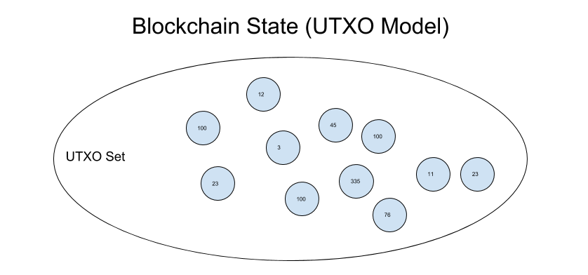
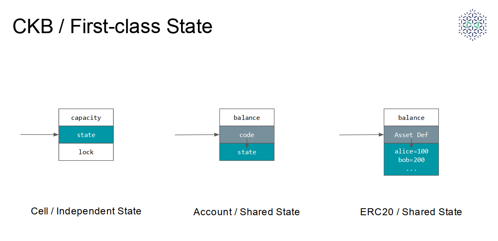

喜欢函数式编程的工程师应该很熟悉一个名词：First-class Function，翻译成中文应该叫“头等函数”或者“一等函数”。First-class Function指的是一类编程语言，在这些语言中函数是一个完全独立的概念：函数可以被当作值赋给一个变量，可以被当作参数传递给其他函数，也可以被当作返回值从其它函数传出来。在这样的语言中我们可以像操纵数据一样操纵函数，所以在这些语言中函数和数据一样是“一等公民”（First-class citizen）。First-class Function是函数式语言的一个关键特性，很多函数式编程的强大能力来源于此。

Nervos CKB使用Cell模型来构建整个共同知识库的状态。Cell模型是一个非常简单但是与现有区块链设计非常不同的状态模型，我们在设计Cell模型的时候已经意识到，基于Cell模型的DApp将拥有一些非常不同的性质，就像函数式编程和面向对象编程会产生风格迥异的设计模式和程序特性一样。在这篇文章中，我想阐述Cell模型可以支持的一种非常有趣的DApp设计模式，我们把它叫做First-class Asset，因为通过它我们可以将用户自定义的加密资产变成区块链中的“一等公民”。

<!--truncate-->

## 状态模型的快速入门

在Cell模型之前，各种区块链使用的状态模型基本上就是两种：UTXO模型和Account模型。

使用UTXO模型的代表是比特币。UTXO是未被花费的交易输出（Unspent Transaction Output）的缩写，一个UTXO可以简单的理解为是一个比特币，然而和一般的硬币不同，每一个UTXO的面值都是不一样的。每个UTXO中都通过一段锁脚本（lock script）记录了这枚硬币的所有者是谁，同时保证只有所有者能够花费这枚硬币。每一个比特币全节点都会维护当前所有UTXO的集合，这个集合我们就称为比特币账本的当前状态（即当前的账本）。每一次比特币转账都是一个从UTXO集合中删除几个硬币（属于付款方）然后又增加几个新硬币（属于收款方和/或付款方）的过程。由于整个账本状态是基于UTXO这个最小单元构建的，我们把它叫做UTXO模型。

使用Account模型的代表是以太坊。Account就是账户，和银行账户类似，代表了资产的所有者，账户里面最重要的数据是余额（Balance），记录这个账户持有的以太币的数量。账户是资产所有者的代表，所有者可以是人（对应外部账户）或者智能合约（对应合约账户），外部账户通过私钥签名来验证资产所有权，合约账户的所有权通过合约代码来确定，合约代码和状态都保存合约账户内部。外部账户要转账的时候，用户在交易中指明转账数量，账本中的付款方账户余额和收款方账户余额就会做相应的减少和增加。由于整个账本状态是基于账户（Account）这个最小单元构建的，我们把它叫做Account模型。

## First-class Coin

UTXO模型和Account模型代表了构建账本状态的两种思路。账本是所有者与资产之间关系的集合。UTXO模型以资产为基础建模，先构建出“硬币”的概念，再给硬币赋予所有者的属性；Account模型以所有者为基础建模，先构建出“账户”的概念，再给账户赋予余额的属性。以哪种方式作为基础模型决定了系统中的操作的基本对象是资产还是账户（所有者）。

所以我们说，硬币（Coin）是UTXO模型中的First-class citizen，每一个UTXO都是一个具有独立标识符的对象（Transaction ID + Output Index），coin是用户直接操作的对象（用户在构造的交易中包含utxo），账户是基于coin建立的上层概念（只存在于钱包中）。因此UTXO是First-class Coin。

在Account模型中，账户是First-class citizen，聚合在账户余额中的硬币没有独立的标识符。账户是用户直接操作的对象，资产的转移是由账户作为用户的代理实现的，这一点在接受方是合约账户时体现的最为明显。在这样的模型下，用户定义加密资产（例如ERC20）更像是通过第三方记账的方式，而非点对点的方式转移，这个差异会将第三方（这里的第三方指的是托管加密资产的智能合约）引入资产转移流程，增加智能合约的设计复杂度（我们可以把智能合约看作在资产转移时会自动执行的逻辑）。为了降低这种复杂度，Account模型中的交易需要加入特殊的逻辑（value字段），但是这样的特殊逻辑只有助于原生资产，同时造成对原生资产和用户自定义资产的不同代码路径。对于这些问题，Kelvin Fitcher写过一篇[Looking at ownership in the EVM ](https://medium.com/@kelvinfichter/looking-at-ownership-in-the-evm-6e6914d341d)进行了很好的分析，在此不再赘述。

有了这些背景，我们应该更容易理解CKB的这一设计理念了：

**有了Cell模型，我们能够简化设计，并在Nervos CKB上实现作为“一等公民”的用户定义资产（User Defined Assets），简称 First-class Assets.**

First-class Assets与UTXO一样，具有独立标识符，可以被用户及脚本直接引用和操作。

## First-class State

如何实现First-class Assets呢？

无论用何种方式，我们都需要记录所有者和资产之间的关系。这些关系记录，本质上是经过共识的状态。要有First-class Assets, 必须先有First-class State，而这正是Cell模型的出发点。

Nervos CKB的名字来自于Common Knowledge Base（共同知识库）的缩写。我们之所以把Nervos网络中的区块链称为“共同知识库“，是因为它的责任是持续不断的对网络的共同状态形成全球共识，换句话说，CKB是一个由全球共识维护的状态库。一个状态库的基本模型，很自然的是将整个状态划分为更小的状态单元组织起来。这些更小的状态单元，就是Cell。

由于Cell是一种状态单元，有独立的标识符（Transaction ID + Cell Output Index），可以被直接引用，作为参数传递给脚本，它是CKB中的“一等公民”，也就是说状态是CKB中的“一等公民”。Cell不仅仅是一种First-class State，而且是最简单的一种First-class State：一个Cell中只有Capacity，Data，Lock以及Type（可选，Type可以是一段代码或者指向一个Code Cell的Reference）四个字段。如下图所示，Cell的所有者可以直接更新Cell中保存的状态，不需要经过任何中间方，而在Account模型中用户只能通过合约代码（账户中的code）来操作账户内的状态，状态实际上是托管在合约手中的。

值得指出的是，有了Cell，CKB实际上就获得了一种有状态的编程模型。一种普遍的观点是，以太坊编程模型的表达能力来自图灵完备的虚拟机，实际上通过账户使得智能合约能够保存计算状态是一个大过EVM的优点（[图灵不完备的语言也有很强大的表达能力 ](https://en.wikipedia.org/wiki/Total_functional_programming)）。CKB通过Cell和CKB-VM（Simple Yet Powerful! 这得另外写一篇文章了）的组合实现了一种新的有状态的智能合约编程模型。这个编程模型更加适合Layer 2，因为通过分析Layer 2协议的共同模式我们可以看到，协议层之间的交互对象应该是状态对象（State Transaction）而不是事件对象（Event Transaction），Layer 1应该是一个状态层而不是计算层。

CKB编程模型的另一个特点是，不区分数据（状态）和代码。这句话的意思是，与Account模型不同，合约的状态和代码都可以储存在Cell的data字段中，保存代码的Cell可以被其它Cell引用（因为它们是First-class State!），合约的状态和代码不需要绑定在一起，存放在一个地方。开发者可以通过一条简单的指令把代码Cell或者数据Cell的内容载入运行时内存，然后根据需要自行将其解释为代码执行或者数据来读写。

有了这些底层支持，我们就可以将一个合约的代码和状态分开保存在不同的地方：Code Cell的code (data)字段存放代码，而State Cell的state (data)的字段则保存状态；在State Cell中通过type ref引用Code Cell来建立对自身保存的state的业务逻辑约束，通过lock ref引用另外一个Code Cell来表达State Cell的所有权。每一个State Cell可以属于不同的用户，因此在Cell模型下独立的用户状态是非常容易实现的模式（在Account模型下，合约状态往往由多个用户状态混合构成，例如在一个ERC20合约中，Alice和Bob的Token余额都记录在同一个合约的内部状态里面）。

如果想对CKB-VM上的合约编写有更多了解，请看[这篇文章 ](https://medium.com/nervosnetwork/an-introduction-to-ckb-vm-9d95678a7757)和[这篇文章 ](https://medium.com/nervosnetwork/hello-ckb-17b8c8fdfba2)

有了这样一种编程模型，我们就能构造First-class Asset了。

## First-class Asset

CKB中的用户定义资产（User Defined Asset）可以这样来构造：

1. 设计资产定义合约（Asset Definition），规定资产的主要约束（例如总数量，发行者，交易前后数量不变等）。
2. 保存合约代码到Asset Definition Cell中。
3. 在满足发行权限的情况下，发行者发行资产，并将资产状态保存在另外的State Cell中。State Cell的Type字段引用保存了资产定义的Code Cell，保证State Cell的变化受到资产定义的约束。
4. Asset Cell的持有者可以通过更新Lock来改变Asset Cell的所有者。

可以看到，在这样的设计中，用户定义的资产是作为独立对象存在于系统中的，每一份资产都是一个Cell，每一份资产都拥有自己的标识符。我们完全可以认为Asset Cell是UTXO的通用化版本。这样的First-class Asset有如下优点：

* Asset Cell可以被引用，可以直接作为其它合约的参数传入。只要引用Asset Cell的input有正确的用户授权，合约就可以正常的使用用户的Asset Cell。
* 资产定义与资产状态分离。Asset Definition Cell的所有者是资产的发行者，而Asset Cell是属于每个用户的。Asset Cell的授权逻辑和业务逻辑分离，所有权完全由自己的lock决定，与Asset Definition的逻辑无关，这意味着First-class Asset不是托管在资产发行者、开发者或是资产定义合约的手中，而是**真正完全属于用户的**。
* 用户的资产相互隔离，用户资产状态独立。CKB的经济模型关注状态存储激励问题：用户在区块链上保存状态不仅需要支付写入费用，而且应该承担与存储时间成正比的存储成本。如果用户的资产状态混合在一个地方保存（例如ERC20），这些状态的存储成本有谁来支付将是一个问题。（CKB Economics Paper正在努力写作中…）
* 只要Asset Definition Cell的lock逻辑允许，资产定义可以独立更新。

上面的示意图只是在CKB上实现 First-class Asset的一种方式。除了上面讨论的方面，还有一些有趣的细节，例如，Asset Definition Cell是不是可以有属于自己的状态？Asset Definition Cell以及Asset Cell的capacity应该由谁来提供？对于这些问题，我们已经有了一些非常漂亮的想法。这些细节的设计、讨论和实现是我们现在正在进行的工作。

## Summary

Cell模型是一个高度抽象的模型，事实上，你不仅可以在Cell上实现First-class Asset，也可以在Cell上模拟Account. 通过这篇文章的介绍我们可以看出，Cell模型是一个不同于UTXO模型和Account模型的新设计。除了状态模型的不同，CKB还将计算（也就是状态生成）转移到了链外，在链上只需要对状态进行验证的逻辑。独特的状态模型和计算验证分离这两点决定了CKB的编程模型上必然会出现新的DApp范式和设计模式。

从CKB白皮书完成到现在将近一年的时间中，我们看到越来越多的人开始关注和讨论First-class State和First-class Asset这两种新的思路（虽然大家用的名词各自都不一样），这些进展让我们非常兴奋。如果你有兴趣对First-class State和First-class Asset进行更多的探讨，或是在CKB的编程模型上有什么有趣的想法，欢迎联系我们讨论～

CKB的代码已经完全开源，这篇文章介绍的内容在代码中都已经实现。欢迎给我们的代码提出各种意见：

* [https://github.com/nervosnetwork/ckb-demo-ruby-sdk ](https://github.com/nervosnetwork/ckb-demo-ruby-sdk) (ckb上用ruby脚本编程的示例，理解ckb上编程模型的最佳入口）
* [https://github.com/nervosnetwork/ckb ](https://github.com/nervosnetwork/ckb)
* [https://github.com/nervosnetwork/ckb-vm ](https://github.com/nervosnetwork/ckb-vm)

感谢Ian Yang, Xuejie Xiao，Kevin Wang在CKB和Cell模型设计中提供的帮助～

---
🔗👉[查看原文](https://talk.nervos.org/t/first-class-asset/405)，获得更多精彩留言。