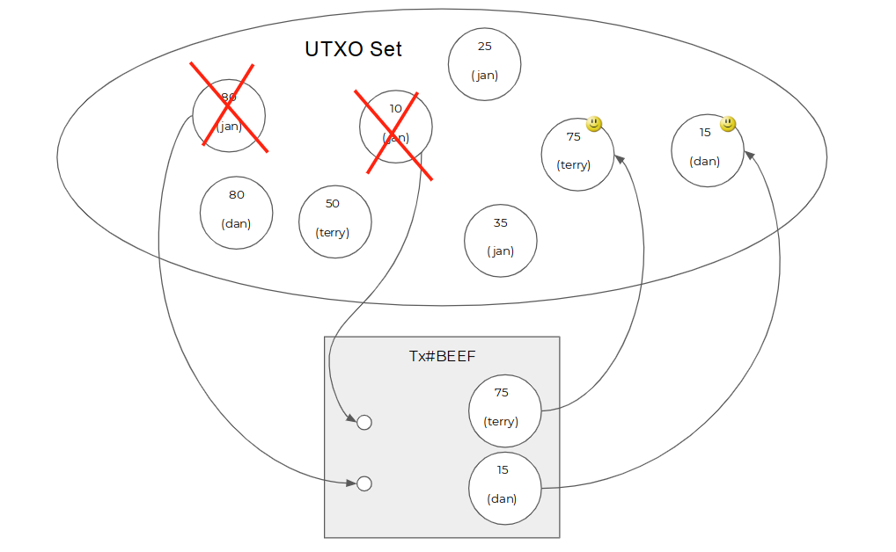
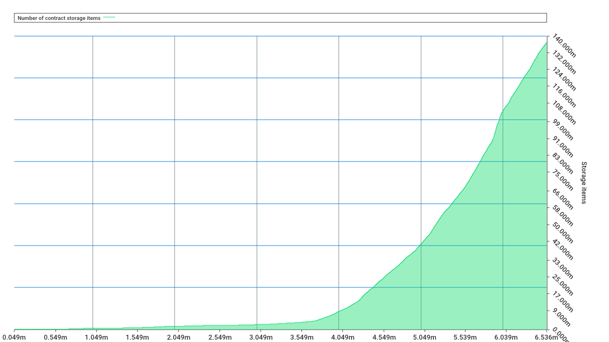

如果[Layer 1的关注点应该是状态而不是计算 ](https://talk.nervos.org/t/layer-1/1486/4), 在设计Layer 1区块链的时候，我们就需要先理解什么是区块链的状态。理解了状态是什么，我们才能理解状态爆炸是什么。

<!--truncate-->

## 状态

区块链网络中的每一个全节点，在网络中运行一段时间之后都会在本地存储上留下一些数据，我们可以按照历史和现在把它们分为两类：

* 历史 - 区块数据和交易数据都是历史，历史是从Genesis到达当前状态的路径。
* 状态（即现在） - 节点在处理完从Genesis到当前高度的所有区块和交易后形成的最终结果。状态随着区块的增加一直处于变化之中，交易是造成变化的原因。

共识协议的作用是通过一系列的消息交换，保证每一个节点看到的当前状态是相同的，而实现这个目标的方式是保证每一个节点看到的历史是相同的。只要历史相同（即所有交易的排序相同），处理交易的方式相同（把交易放在相同的确定性虚拟机里面执行），最后看到的当前状态就是相同的。当我们说“区块链具有不可篡改性”的时候，指的是区块链历史不可篡改，相反，状态是一直在变化的。

有趣的是，不同的区块链保存历史和状态的方式不同的，其中的差异使得不同的区块链形成了各自的特点。由于这篇文章讨论的话题是状态，而影响状态的历史数据主要是交易（而不是区块头），接下来的讨论历史的时候会侧重交易，忽略区块头。

### Bitcoin的历史和状态

Bitcoin的状态，指的是Bitcoin账本当前的样子。Bitcoin的状态是由一个个UTXO（尚未花费的交易输出）构成的，每个UTXO代表了一定数量的Bitcoin，每个UTXO上面写了一个名字（scriptPubkey），记录这个UTXO的所有者是谁。如果要做一个比喻的话，Bitcoin的当前状态是一个装满了金币的袋子，每个金币上刻着所有者的名字。

Bitcoin的历史由一连串的交易构成，交易内部的主要结构是输入和输出。交易更改状态的方法是，把当前状态中包含的一些UTXO（交易输入引用的那些）标记为已花费，从UTXO集合中移出，然后把一些新的UTXO（这个交易的输出）添加到UTXO集合里面去。

可以看出，Bitcoin交易的输出（TXO，Transaction Output）正是上面说的UTXO，UTXO只不过是一种处于特殊阶段（尚未花费）的TXO。因为构成Bitcoin状态的组件(UTXO)，同时也是构成交易的组件(TXO)。由此Bitcoin有一个奇妙的性质：**任意时刻的状态都是历史的一个子集，历史和状态包含的数据类型是同一维度的**。交易的历史（所有被打包的交易的集合，即所有产生过的TXO的集合）即状态的历史（每个区块对应的UTXO集合的集合，也是所有产生过的TXO的集合），Bitcoin的历史只包含交易。

在Bitcoin网络中，每一个区块，每一个UTXO都要持续占用节点的存储空间。目前Bitcoin[整个历史的大小（所有区块加起来的大小）大约是200G ](https://www.blockchain.com/en/charts/blocks-size)，而[状态的大小只有~3G(由~5000万个UTXO组成) ](https://statoshi.info/dashboard/db/unspent-transaction-output-set)。Bitcoin通过对区块大小的限制很好的管理了历史的增长速度，由于其历史和状态之间的子集关系，状态数据大小必然远小于历史数据大小，因此状态增长也间接的受到区块大小的管理。

### Ethereum的历史和状态

Ethereum的状态，也叫做“世界状态”，指的是Ethereum账本当前的样子。Ethereum的状态是由账户构成的一棵Merkle树（账户是叶子），账户里面不仅记录了余额（代表一定数量的ether），还有合约的数据（例如每一只加密猫的数据）。Ethereum的状态可以看作一个大账本，账本的第一列是名字，第二列是余额，第三列是合约数据。

Ethereum的历史同样由交易构成，交易内部的主要结构是

* to - 另一个账户，代表交易的发送对象
* value - 交易携带的ether数量
* data - 交易携带的任意信息

交易更改状态的方法是，EVM找到交易发送的目标账户，

1. 根据交易的value计算目标账户的新余额；
2. 将交易携带的data作为参数传递给目标账户的智能合约，运行智能合约的逻辑，在运行中可能会修改任意账户的内部状态生成新的状态；
3. 构造新的叶子存放新的状态，更新状态Merkle树

可以看出，Ethereum的历史和交易结构与Bitcoin相比有非常大的不同。Ethereum的状态是由账户构成的，而交易是由触发账户变动的信息构成，状态和交易中记录的是完全不同类型的数据，二者之间没有超集和子集的关系，**历史和状态所包含的数据类型是两个维度的**，交易历史大小与状态大小之间没有必然的联系。交易修改状态后，不仅会产生新的状态（图中实线框的叶子），而且会留下旧的状态（图中虚线框的叶子）成为历史状态，因此Ethereum的历史不仅仅包含交易，还包含历史状态。因为历史和状态属于不同的维度，Ethereum区块头中不仅仅包含交易的merkle root, 也需要显式包含状态的merkle root。（思考题：EOS使用了类似Ethereum的账户模型，却没有在区块头中包含状态的Merkle Tree Root，这是好还是不好？）

Ethereum中每一个区块，每一个账户都会持续占用节点的存储空间。Ethereum节点在同步的时候有多种模式，在Archive模式下所有的历史和状态都会保存下来，其中历史包括历史交易和历史状态，[所有数据加起来大小超过了2TB ](https://etherscan.io/chartsync/chainarchive)；在Default模式下，历史状态会被裁剪掉，本地只保留历史交易和当前状态，[所有数据加起来大约是170G ](https://etherscan.io/chartsync/chaindefault)，其中[交易历史大小是150G，当前状态大小是10G ](http://webcache.googleusercontent.com/search?q=cache:http://didtheethereumblockchainreach1tbyet.5chdn.co/)。Ethereum中所有的开销管理都被统一到gas计费模型之下，[交易的大小需要消耗对应的gas ](https://ethereum.stackexchange.com/questions/1106/is-there-a-limit-for-transaction-size)，而每一条EVM指令消耗的gas，不仅考虑了计算开销，[也将存储开销考虑在内 ](https://medium.com/coinmonks/storing-on-ethereum-analyzing-the-costs-922d41d6b316)。通过每个区块的gaslimit，间接限制了历史和状态的增长速度。

ps. 常见的一个误解是，Ethereum的“区块链大小”已经超过1T了。从上面的分析我们可以看到，“区块链大小”是一个非常模糊的定义，如果把历史状态算进去，确实超过了，但是对于全节点来说，把历史状态删掉没有任何问题，因为只要有Genesis和交易历史，任意时刻的历史状态都可以重新被计算出来（不考虑计算需要的时间）。真正有意义的数据，是全节点必须的数据的大小，Bitcoin是200G，Ethereum是170G，两者是基本相同的，而且在平均配置的云主机上都能装下，因此人们观察到的[Ethereum全节点减少 ](https://www.trustnodes.com/2019/01/09/bitcoin-overtakes-ethereum-in-node-numbers) 并不是由于存储增加导致的（根本原因是同步时的计算开销，这里不展开了）。考虑到Ethereum的历史长度（当前区块的timestamp减去genesis的timestamp）不到Bitcoin的一半，可以看出Ethereum的历史和状态大小增长更快。

## 区块链版本的公地悲剧

[公地悲剧 ](https://en.wikipedia.org/wiki/Tragedy_of_the_commons) 所指的是这样一种情况，有限的共享资源在不受任何限制的使用下被人们过度消耗。区块链节点为保存历史和状态付出的存储，正是这样一种共享资源。

区块链节点为处理交易所花费的资源有三种，CPU，存储和网络带宽。CPU和带宽都是每个区块会刷新的资源，我们可以认为每个区块间隔内都用同样多的CPU和带宽可供使用，上个区块消耗掉的CPU和带宽不会让下个区块可用的CPU和带宽变少。对于可刷新的资源，我们可以通过一次性支付的交易手续费来补偿节点（手续费与计算复杂度和交易大小的相关性可参考[RFC0015 Appendix ](https://github.com/nervosnetwork/rfcs/blob/0015-crypto/rfcs/0015-ckb-cryptoeconomics/0015-ckb-cryptoeconomics.md)）。

与CPU和带宽不同，存储是一种占用资源，在一个区块中被占用了的存储，除非使用者主动释放，否则无法在后面的区块中被其它使用者使用。节点需要为存储持续的付出成本，而使用者却不需要为存储持续的支付手续费（记住交易手续费只需要支付一次）。使用者只需要在往区块链写数据的时候支付一点点手续费，就可以永久使用一个可用性超过Amazon S3的存储，其无限大的永久存储成本需要区块链网络中的所有全节点来承担。

Ethereum上由于各种DApp的存在，The Tragedy of (Storage) Commons相对更加严重。例如，[在区块5700001（May 30, 2018）的时候，使用状态最多的5个合约 ](https://github.com/Mine77/eth-storage-analyze/blob/master/data/first200_on5700001.csv) 是：

1. EtherDelta, 5.09%
2. IDEX, 4.17%
3. CryptoKitties, 3.05%
4. ENS, 1.92%
5. EOS Sale, 1.73%

比较有趣的是最后一个，EOS Sale。虽然EOS的众筹已经完成，EOS代币已经在EOS链上流转，EOS众筹的记录却永远留在了Ethereum的节点上，消耗Ethereum全节点的存储资源。

可以看到，在缺乏管理的情况下，区块链的存储资源会被有意或者无意的滥用。在一个设计合理的经济模型中，使用者必须承担存储占用的成本，这个成本不仅仅与占用存储空间的大小成正比，还与占用时间的长度成正比。

## 状态爆炸

无论是历史还是状态数据都会占用存储资源。通过上面对Bitcoin和Ethereum的分析（其他区块链的状态模型基本都可以归纳为二者之一）可以看到，虽然它们对历史和状态的增长进行了管理，但是对历史和状态的总大小却没有任何控制，这些数据会持续的无休止的累积下去，使得运行全节点需要的存储资源越来越大，[提高全节点的运行门槛，使网络的去中心化程度越来越低 ](https://talk.nervos.org/t/dont-trust-verify/335)，这是我们不愿意看到的。

你也许会说，有没有可能硬件平均水平的提高会超过历史和状态的积累速度？我的回答是可能性很低：

从这张图中我们可以看到，随着Ethereum网络的发展，状态数据累积的数量呈指数式的增长。Bitcoin的状态数据从0积累到3G，用了10年；Ethereum的状态数据从0积累到10G，用了4年；而这是在我们还没有解决Scalability问题，区块链仍然是小众技术的情况下的增长速度。当我们解决了scalability问题，区块链真正获得mass adoption，DApp和用户数量都爆炸式增长的时候，区块链历史和状态数据会以什么速度累积呢？

这就是状态爆炸问题，我们把它归类为post-scalability problem，因为它在解决scalability问题之后会非常明显。我们最早是在做[许可链场景落地 ](https://www.citahub.com/) 时注意到了这个问题，因为[许可链的性能远高于公有链 ](https://mp.weixin.qq.com/s/nKcM4G9plxZLneFtea6Lpg)，刚好处于post-scalability的阶段。（思考题：许可链怎么解决状态爆炸问题？）

历史数据的累积相对容易处理，未来可以通过去中心化的Checkpoint或是零知识证明等技术来压缩，在那之前全节点甚至可以把历史直接丢掉，依然可以正常运行。 状态数据的累积则麻烦许多，因为它是全节点运行必须的数据。

不少区块链项目已经看到了这个问题，并提出了一些解决方案。EOS RAM是解决状态爆炸问题的一个有益尝试：RAM代表了超级节点服务器可用的内存资源，无论是账户、合约状态还是代码，都需要占用一定的RAM才能运行。RAM的设计也有很多问题，它需要通过内置的交易市场购买，不可转让，无法租用，将合约执行过程中的短期内存需求和合约状态的长期存储需求混在了一起，而且RAM的总量的设定没有确定的规则，更多取决于超级节点可以承受的硬件配置，而非[共识空间的成本 ](https://talk.nervos.org/t/nervos-bitcoin/1372/50)。

Ethereum社区也看到了这个问题并提出了[Storage Rent的方案 ](https://github.com/ethereum/EIPs/pull/1682)：要求使用者为存储资源的使用预支付一笔租金，占用存储资源会持续消耗这笔租金，占用时间越长，使用者需要支付的租金越多。Storage Rent方案存在两个问题：1. 预支付的租金终有一天会用完，这时候如何处理占用的状态？正是为解决这个问题，Storage Rent需要诸如resurrection的机制来补充，[增加了设计的复杂度 ](https://github.com/ledgerwatch/eth_state/blob/master/State_Fees_3.pdf)，使智能合约的immutability大打折扣，也为[使用体验带来了麻烦 ](https://ethresear.ch/t/improving-ux-for-storage-rent/3994)；2. Ethereum的状态模型是一种共享状态的模型，[而不是First-class State ](https://talk.nervos.org/t/first-class-asset/405)。以ERC20 Token为例，所有用户的资产记录都存放在单个ERC20合约的存储里面，在这种情况下，应该由谁来支付租金？

解决状态爆炸问题也是Nervos CKB的设计目标之一，为此CKB走了一条完全不同的、更为彻底的变革之路。

---
🔗👉[查看原文](https://talk.nervos.org/t/topic/1515)，获得更多精彩留言。