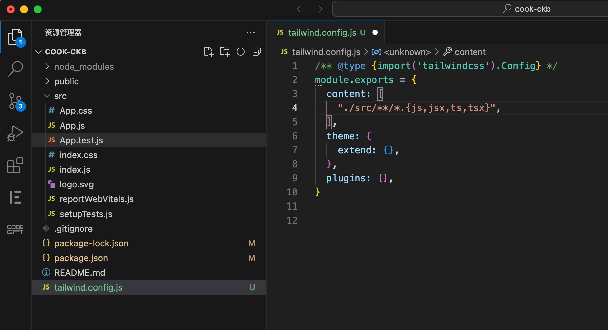

# Create a new dapp

在这个示例里，我们将演示使用 CRA（ [Create React App](https://create-react-app.dev/docs/getting-started) ）模版创建一个名为 cook-ckb 的 demo 示例。

## Create React App

下面的命令将创建一个名为 cook-ckb 的 React 应用程序：
```
npx create-react-app cook-ckb
```

## 配置 Tailwind CSS

[Tailwind CSS](https://tailwindcss.com/docs/installation/framework-guides) 是一个实用的 CSS 框架，它提供了一系列的 CSS 类，可以帮助您快速构建现代化的 Web 界面。与其他 CSS 框架不同的是，Tailwind CSS 的 CSS 类并不是预定义好的，而是基于一组原子类构建的。这些原子类可以单独使用，也可以组合在一起，以创建任何样式。这种方法使得 Tailwind CSS 更加灵活，可以适应各种不同的设计需求。此外，Tailwind CSS 还提供了许多实用的工具类，如响应式设计、间距、背景、边框等，可以帮助您更加高效地编写 CSS 代码。

### 安装 Tailwind CSS

通过 npm 安装 tailwindcss，然后创建你自己的 create your tailwind.config.js 配置文件。

```
npm install tailwindcss
npx tailwindcss init
```

### Configure your template paths
Add the paths to all of your template files in your tailwind.config.js file.
```
/** @type {import('tailwindcss').Config} */
module.exports = {
  content: [
    "./src/**/*.{js,jsx,ts,tsx}",
  ],
  theme: {
    extend: {},
  },
  plugins: [],
}
```



### Add the Tailwind directives to your CSS
Add the @tailwind directives for each of Tailwind’s layers to your ./src/index.css file.

```
@tailwind base;
@tailwind components;
@tailwind utilities;
```

## 启动应用

```
npm run start
```

## Install lumos


## Config lumos

